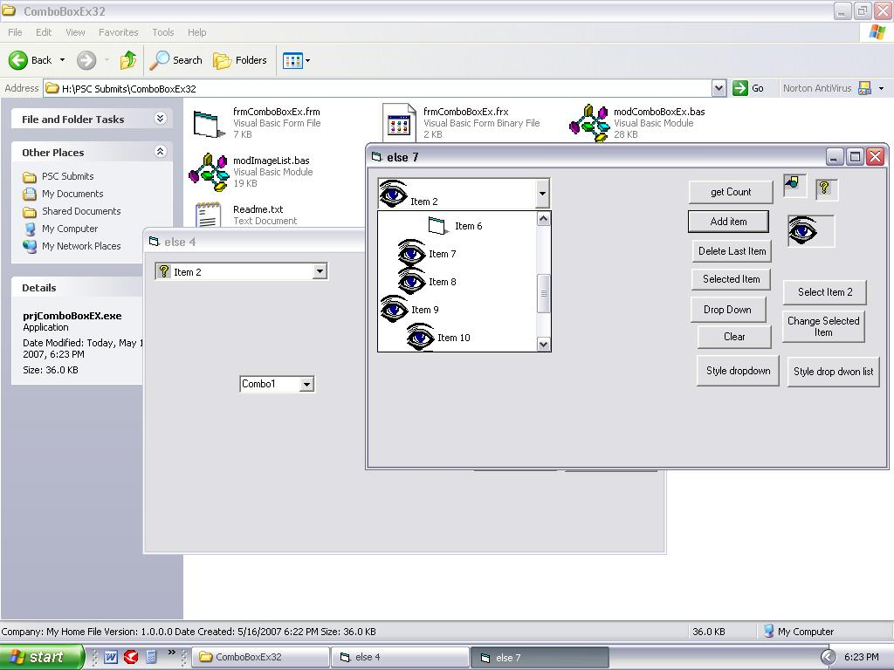



## Improved ComboBoxEx\-\(Included Comments\)

### Description

ComboBoxEX in VB

**Features**

Can set Icons,Bitmaps to items

can set indent to items

Faster operations

NO OCXs DLLs , Pure API

Best Performance

Best Speed

Different Icon size

----

Now included comments per line so you can easily understand.

example of ComboBoxEX all API***Please Vote!***
 
### More Info
 

             |
---                |---
**Submitted On**   |2007-05-16 00:34:12
**By**             |[Joshy Francis](https://github.com/Planet-Source-Code/PSCIndex/blob/master/ByAuthor/joshy-francis.md)
**Level**          |Advanced
**User Rating**    |4.8 (19 globes from 4 users)
**Compatibility**  |VB 6\.0
**Category**       |[Windows API Call/ Explanation](https://github.com/Planet-Source-Code/PSCIndex/blob/master/ByCategory/windows-api-call-explanation__1-39.md)
**World**          |[Visual Basic](https://github.com/Planet-Source-Code/PSCIndex/blob/master/ByWorld/visual-basic.md)
**Archive File**   |[Improved\_C2066265182007\.zip](https://github.com/Planet-Source-Code/joshy-francis-improved-comboboxex-included-comments__1-68617/archive/master.zip)

